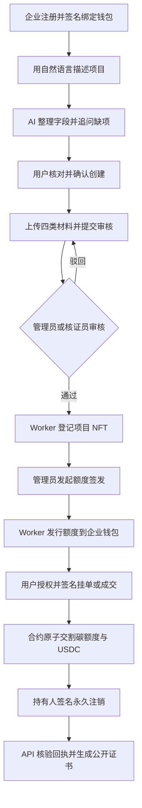
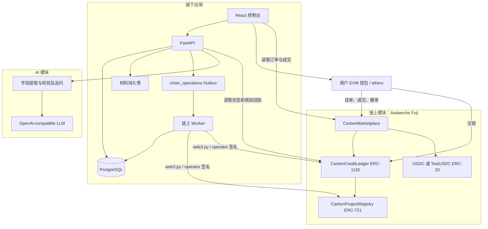

# CarbonLink — AI 辅助的碳资产申报与链上交易平台

CarbonLink 帮助企业将碳项目申报资料整理为可审核档案，并通过自托管钱包完成碳额度的链上签发、交易与永久注销。

## 项目简介

企业碳项目从资料准备到额度流转，往往跨越申报表单、人工核证和交易记录等多个环节：申报方不清楚该补哪些材料，核证方需要追踪审核过程，购买方则需要核验额度来源、持有状态与注销结果。

CarbonLink 面向项目开发企业、平台核证人员与碳额度购买方，将这些环节串成同一条业务流程：AI 协助整理申报信息，人工完成审核，智能合约记录项目与额度，用户用自己的钱包交易和注销。数据库保存身份、材料及业务流程；在链上模式下，资产余额和结算以合约为准。

项目从 `carbin-ai` 申报原型演进，市场交互参考 Mini-DEX，包含前端、Backend API、链上 Worker、Solidity 合约及验收工具。

**评委快速体验：** 按「本地运行」执行 `docker compose up --build -d`，访问 [本地控制台](http://localhost:3000)。默认关闭区块链，可体验申报和数据库业务流程；完整钱包交易演示需要配置 Fuji 合约、测试资产与签名 Worker。AI 对话需要单独配置模型服务。

> 当前仓库提供实现和部署脚本，本文不将其等同于已上线、已通过独立审计或已获得碳标准认证。公开 Demo、部署地址和本次测试结果尚待补充。

## 核心功能

- **AI 企业申报：** 从自然语言中提取项目字段、识别缺项、处理更正与单位换算，由用户确认创建档案。
- **材料与人工核证：** 管理项目设计、权属证明、方法学说明、监测材料，支持提交、审核、驳回及审计事件。
- **自托管资产：** 通过签名挑战绑定钱包；项目 NFT 与 ERC-1155 碳额度发行到项目方钱包。
- **统一碳交易市场：** 共享 `CARBON/USDC` 订单簿，支持买卖限价单、部分成交、撤单和链上原子交割。
- **永久注销与证书：** 持有人签名销毁额度，服务端核验链上回执后生成可公开查询的注销证书。
- **可追踪的链上任务：** Outbox、独立 Worker、原始交易持久化、确认数检查及重试连接审核流程与链上执行。

## Demo / 使用流程

推荐以「园区屋顶光伏项目申报 → 核证 → 签发 → 买方购买 → 注销」演示完整生命周期。示例中的项目资料和减排量需要演示者提供，不代表已核证的真实减排成果。



演示前准备：

1. 配置 LLM，准备企业账户、管理员账户以及买卖双方测试钱包。
2. 部署并启用 Fuji 合约，确保 Worker 的 operator 有登记、发行权限和测试 AVAX。
3. 买卖钱包准备 Gas；买方准备与市场合约一致的结算代币，首次使用时执行代币授权。
4. 上传项目设计文件（PDD）、权属或授权证明、方法学适用性说明、监测计划与基线数据。
5. 等待项目登记和额度签发达到配置的链上确认数，再演示交易、注销及证书查询。

默认 `BLOCKCHAIN_ENABLED=false` 使用数据库模式，不产生真实链上资产；不能用该模式的交易记录证明 Fuji 结算成功。

## 为什么需要 AI

AI 的价值在于降低企业填写结构化申报表单的门槛：用户可以分多轮描述项目，系统结合当前草稿和最近对话，提取名称、项目类型、地区、方法学、预计减排量及项目说明。

实际职责包括：

- 归类明确的项目活动，把用户明确提供的单位换算为 `tCO₂e`。
- 处理自然语言更正和撤回，避免要求用户重新填写整张表单。
- 结合 Pydantic 校验结果，针对缺项生成下一轮追问。
- 根据服务端提供的项目资料、材料文件名和审核反馈回答当前项目问题。

实现直接使用 OpenAI SDK 调用 OpenAI-compatible Chat Completions，以 JSON 输出配合结构校验；可配置兼容的 DeepSeek 等服务。当前未使用 LangChain、LangGraph、向量数据库或 RAG，也不读取附件正文。

AI 不猜测缺失的方法学和减排数值，不核证申报事实，不自动创建或提交项目，不签名交易。模型不可用时保留页面草稿并提供辅助表单。对话与未保存草稿在页面内存中，刷新会丢失；确认创建后的项目保存在数据库。

`user-agent/` 另外提供用于验收的浏览器 Agent：可按自然语言目标选择受限页面操作。这是测试工具，与企业申报 AI 的业务职责不同。

## 为什么需要 Web3 / Avalanche

普通数据库可以实现申报与审批，但如果额度持有、交割和注销都由平台数据库决定，参与方仍需完全信任平台修改记录的权限。CarbonLink 在链上模式下将这些资产规则交给合约执行：

- **钱包所有权：** 用户持有 ERC-721 项目 NFT 和 ERC-1155 额度，交易和注销由本人签名。
- **原子结算：** 卖单托管指定批次额度，买单托管 USDC，成交在同一笔交易中完成两种资产交割。
- **可核验生命周期：** 登记、发行、成交和注销产生链上记录，便于外部核验。
- **永久注销：** 合约销毁持有人额度并记录受益方哈希与证据摘要，防止同一链上额度重复使用。

项目采用 Avalanche Fuji C-Chain 作为测试网络，复用 EVM、Solidity 和现有钱包工具。当前实现未使用独立 Avalanche L1、跨链消息或跨链资产桥。

链上记录证明的是合约执行和数据承诺，不能自动证明现实减排量真实，也不能排除其他系统对同一现实项目重复签发；材料审核、方法学适用性和核证治理仍是链下职责。

## 系统架构



- **链下：** 身份、角色、申报材料、审核过程、任务状态和证书查询；Nginx 同域代理 `/api`。
- **AI：** 整理申报草稿与项目问答，不承担资产权限。
- **链上：** 项目标识、额度余额、订单资产托管、结算和注销。
- **协作边界：** 审核、签发请求写入 Outbox，Worker 广播并确认交易，回填哈希、区块与 token ID。用户交易由前端钱包直接提交。证书仅在 API 核验交易、地址、批次、数量及相关摘要后生成。

链上模式下，旧中心化挂单和结算写接口返回 `410`；数据库模式保留原有业务演示路径。签名 Worker 使用 PostgreSQL 账户锁，不能用 SQLite 替代。

## 技术栈

| 类别 | 实际使用的技术与用途 |
| --- | --- |
| Frontend | React 19、TypeScript、Vite、React Router、自定义 CSS；lightweight-charts 展示市场图表；ethers 6 连接钱包与合约 |
| Backend | Python 3.12+、FastAPI、Pydantic Settings、SQLAlchemy、Alembic、psycopg、PostgreSQL 17 |
| 认证 | JWT、Argon2 密码哈希、管理员 / 核证员 / 成员角色、钱包签名挑战 |
| AI | OpenAI Python SDK、OpenAI-compatible Chat Completions、JSON 输出与 Pydantic 校验 |
| Blockchain | Solidity（编译器 0.8.30）、Foundry、OpenZeppelin、web3.py、Avalanche Fuji C-Chain |
| 部署与验证 | Docker Compose、Nginx、pytest、Foundry 测试、Node.js Test Runner、Playwright |

依赖精确版本以 `pyproject.toml`、`requirements.lock`、两个 `package.json` 和 `contracts/foundry.toml` 为准。

## 项目目录结构

```text
carbon-link/
├── app/                         # API、认证、业务服务、AI 与链上 Worker
│   ├── application_agent.py     # 申报提取、校验、追问和项目问答
│   ├── chain_worker.py          # Outbox 消费、签名、广播与确认
│   └── self_custody_migration.py # 旧托管资产迁移工具
├── carbon-link-front/           # React 控制台、钱包与市场界面
├── contracts/
│   ├── src/                     # 三份业务合约和 TestUSDC
│   ├── script/                  # 全量部署、市场替换、测试代币部署
│   └── test/                    # Foundry 合约测试
├── alembic/versions/             # 数据库迁移
├── tests/                       # Python API、业务及安全回归测试
├── user-agent/                  # 浏览器批量验收与自然语言目标 Agent
├── docs/                        # 操作、部署、设计和内部审查记录
├── .env.example                 # 应用环境变量模板
├── compose.yaml                 # 前端、API、Worker、PostgreSQL
├── compose.contracts.yaml       # Foundry 容器测试入口
├── Dockerfile                   # API 运行和测试镜像
├── requirements.lock            # Python 依赖约束
├── THIRD_PARTY_NOTICES.md        # 第三方来源及许可说明
└── README.md
```

## 智能合约

| 合约 | 职责 | 核心方法 | 主要 Event |
| --- | --- | --- | --- |
| `CarbonProjectRegistry` | ERC-721 项目登记、摘要、URI 和状态管理 | `registerProject`、`updateMetadata`、`setProjectStatus`、`isActive` | `ProjectRegistered`、`ProjectStatusChanged`、`ProjectMetadataUpdated` |
| `CarbonCreditLedger` | ERC-1155 批次发行、转移、冻结和永久注销 | `issueBatch`、`retire`、`setBatchFrozen`、`updateBatchMetadata`、`getRetirement` | `CreditBatchIssued`、`BatchFrozenStatusChanged`、`BatchMetadataUpdated`、`CreditRetired` |
| `CarbonMarketplace` | 买卖单资产托管、部分成交和原子结算 | `createSellOrder`、`createBuyOrder`、`fillSellOrder`、`fillBuyOrder`、`cancel`、`quoteFor` | `OrderCreated`、`OrderFilled`、`OrderCancelled` |
| `TestUSDC` | 本地链 / 测试网六位精度 `tUSDC` | `mint`、`decimals` 及 ERC-20 标准方法 | ERC-20 `Transfer`、`Approval`；Ownable `OwnershipTransferred` |

`CarbonCreditLedger` 引用项目登记合约；市场引用额度合约与结算代币。每 `1 tCO₂e = 10,000` 个额度基础单位，结算代币按 6 位精度处理。所有合格批次共享交易对，卖单指定实际批次，买单接受任意合格批次；当前没有按方法学或年份分立的市场。

权限模型：

- 三份业务合约使用 `AccessControlDefaultAdminRules`，管理员交接采用延迟两步流程，部署脚本默认延迟 `172800` 秒。
- `REGISTRAR_ROLE` 登记项目和更新项目元数据；`ISSUER_ROLE` 签发额度。
- `VERIFIER_ROLE` 管理项目状态、批次冻结及批次元数据；`PAUSER_ROLE` 执行暂停与恢复。
- 部署脚本为 operator 授予登记和发行角色，admin 持有治理及相应操作角色。API 的用户角色与链上角色是两个独立权限体系。
- 市场无平台代交易或提取用户托管资产的方法；用户签名挂单、成交，订单创建者撤单。`TestUSDC` 的 owner 可增发测试代币。
- 业务合约不使用升级代理，替换合约需要新部署及显式迁移。

治理边界：撤销项目阻止后续发行，但不会自动作废已有批次；批次交易能力由冻结和暂停控制。市场暂停仍允许撤单，但额度合约暂停或批次冻结可能阻止卖单资产返还。买单分笔支付存在基础单位舍入，最后一笔结清剩余托管额。

下表是待补充的部署登记，不表示已经验证部署成功：

| Contract | 目标网络 | Address |
| --- | --- | --- |
| `CarbonProjectRegistry` | Avalanche Fuji C-Chain | `<Project Registry Contract Address>` |
| `CarbonCreditLedger` | Avalanche Fuji C-Chain | `<Credit Ledger Contract Address>` |
| `CarbonMarketplace` | Avalanche Fuji C-Chain | `<Marketplace Contract Address>` |
| 结算 USDC / 可选 `TestUSDC` | Avalanche Fuji C-Chain | `<USDC Contract Address>` |

## 网络信息

仓库默认配置和部署脚本面向以下网络，实际部署尚需公开交易及地址佐证：

```text
Network: Avalanche Fuji C-Chain
Chain ID: 43113
RPC URL: https://api.avax-test.network/ext/bc/C/rpc
Gas Token: AVAX（测试网）
```

浏览器 RPC 由 `BLOCKCHAIN_PUBLIC_RPC_URL` 提供，不能包含私有服务端 Key。Anvil 本地开发通常使用 `http://127.0.0.1:8545`、Chain ID `31337`，需同步修改应用配置及合约地址。容器中的 `127.0.0.1` 不指向宿主机，连接宿主机 Anvil 时应另行配置可达地址。

## 环境要求

- 快速体验：Git、Docker Engine / Docker Desktop、Docker Compose v2。
- 本地 Backend 开发：Python **3.12+**；签名 Worker 和并发锁验证需要 PostgreSQL，Compose 使用 **17-alpine**。
- 本地 Frontend 开发：Node.js **22**（与前端构建镜像一致）、npm。
- 合约开发：Foundry **v1.7.1**（仓库镜像版本），或通过 Docker 使用 Foundry；Windows 可在 WSL 中运行原生 Foundry。
- 钱包演示：支持 EVM 的浏览器钱包、测试 AVAX 和所配置的结算代币。
- 浏览器验收：`user-agent/` 依赖及 Playwright Chromium；LLM 仅在 AI 对话或 `goal` 场景中需要。

## 环境变量

从根目录 `.env.example` 复制配置。以下占位符必须替换；不使用的可选项留空。

```dotenv
ENVIRONMENT=development
FRONTEND_PORT=3000
API_PORT=8000
POSTGRES_PASSWORD=<Strong Database Password>
DATABASE_URL=postgresql+psycopg://carbon:<URL-encoded Database Password>@localhost:5432/carbon_link
JWT_SECRET=<Random Secret At Least 32 Characters>
ACCESS_TOKEN_MINUTES=30
BOOTSTRAP_ADMIN_EMAIL=<Admin Email>
BOOTSTRAP_ADMIN_PASSWORD=<Strong Admin Password>
CORS_ORIGINS=["http://localhost:3000","http://localhost:5173"]
FRONTEND_URL=http://localhost:3000
LOG_LEVEL=INFO
UPLOAD_DIR=./uploads
MAX_UPLOAD_BYTES=20971520

LLM_API_KEY=
LLM_BASE_URL=
LLM_MODEL=gpt-4.1-mini

BLOCKCHAIN_ENABLED=false
BLOCKCHAIN_NAME=avalanche-fuji
BLOCKCHAIN_RPC_URL=https://api.avax-test.network/ext/bc/C/rpc
BLOCKCHAIN_PUBLIC_RPC_URL=https://api.avax-test.network/ext/bc/C/rpc
BLOCKCHAIN_CHAIN_ID=43113
BLOCKCHAIN_CONFIRMATIONS=3
BLOCKCHAIN_REQUEST_TIMEOUT_SECONDS=30
BLOCKCHAIN_WORKER_POLL_SECONDS=5
BLOCKCHAIN_WORKER_MAX_ATTEMPTS=10
BLOCKCHAIN_TRANSACTION_TIMEOUT_SECONDS=1800
CARBON_PROJECT_CONTRACT_ADDRESS=
CARBON_CREDIT_CONTRACT_ADDRESS=
CARBON_MARKETPLACE_CONTRACT_ADDRESS=
USDC_CONTRACT_ADDRESS=
BLOCKCHAIN_OPERATOR_ADDRESS=
BLOCKCHAIN_SIGNER_URL=
BLOCKCHAIN_OPERATOR_PRIVATE_KEY=

PASSWORD_RESET_MINUTES=30
SMTP_HOST=
SMTP_PORT=587
SMTP_USERNAME=
SMTP_PASSWORD=
SMTP_FROM=
SMTP_STARTTLS=true
```

- Compose 根据 `POSTGRES_PASSWORD` 组装数据库连接，**不会使用根 `.env` 中的 `DATABASE_URL`**；原生 Python 进程则读取该变量。连接串中的密码须做 URL 编码；Compose 内插方式也需注意密码特殊字符。
- `JWT_SECRET` 至少 32 字符；生产模式拒绝若干内置默认凭据。初始管理员只在对应邮箱不存在时创建，修改启动变量不会重置已有账户密码。
- `LLM_BASE_URL` 为空时使用 SDK 默认服务地址；模型名与 API Key 必须匹配所选服务。
- 启用链上模式必须填齐 RPC、四个合约地址、operator 地址及签名配置，否则启动校验失败。签名方式选择外部 `BLOCKCHAIN_SIGNER_URL` 或测试用私钥；仓库未提供外部签名服务的部署实现。
- `UPLOAD_DIR` 在 Compose 中固定为 `/app/uploads` 并挂载持久卷；`MAX_UPLOAD_BYTES`、`LOG_LEVEL` 当前未显式传入 Compose 服务，修改根 `.env` 不会自动改变容器内这两项配置。
- SMTP 未配置时不能完成邮件找回密码；API 不返回重置令牌。

> 不要将私钥、助记词、API Key、数据库密码或 SMTP 密码提交到 GitHub，也不要写入前端构建变量。

## 本地运行

### 1. 获取项目并准备配置

```bash
git clone https://github.com/a13132136465/carbon-link.git
cd carbon-link
cp .env.example .env
```

Windows PowerShell 可使用 `Copy-Item .env.example .env`。已有 `.env` 时请直接编辑，避免覆盖本地配置。

设置强数据库密码、至少 32 字符的 `JWT_SECRET`、管理员邮箱和密码；本地体验可设置 `ENVIRONMENT=development`。将 `CORS_ORIGINS` 改为本地访问来源。要体验自然语言申报，填写 LLM 配置。

### 2. 一键启动数据库、Backend 和 Frontend

```bash
docker compose up --build -d
docker compose ps
docker compose logs --tail=100 api chain-worker
```

API 启动时执行 `alembic upgrade head`，首次创建初始管理员；数据库和附件分别保存在命名卷中。默认关闭链上功能，无需配置合约即可启动。

| 入口 | 地址 |
| --- | --- |
| 管理与企业控制台 | [http://localhost:3000](http://localhost:3000) |
| OpenAPI 文档 | [http://localhost:8000/docs](http://localhost:8000/docs) |
| 就绪检查 | [http://localhost:8000/health/ready](http://localhost:8000/health/ready) |
| 存活检查 | [http://localhost:8000/health/live](http://localhost:8000/health/live) |

用配置的管理员账户登录；企业用户可自行注册。端口可通过 `FRONTEND_PORT`、`API_PORT` 调整。

### 3. 可选：原生 Backend 开发

以下命令在仓库根目录运行。先准备可从宿主机访问的 PostgreSQL 数据库，将根 `.env` 的 `DATABASE_URL` 指向它；当前 Compose 数据库未映射宿主机端口，不能直接从宿主机连接 `db:5432`。

仅体验非链上流程时，也可设置 `DATABASE_URL=sqlite:///./carbon_link.db`；该方式不适用于签名 Worker 或 PostgreSQL 锁测试。

```bash
python -m venv .venv
# Linux / macOS
source .venv/bin/activate
# Windows PowerShell 改用：.\.venv\Scripts\Activate.ps1
python -m pip install -c requirements.lock -e ".[test]"
alembic upgrade head
uvicorn app.main:app --reload --host 127.0.0.1 --port 8000
```

启用链上模式后，在另一个已激活同一虚拟环境的终端启动 Worker：

```bash
python -m app.chain_worker
```

### 4. 可选：Frontend 热更新开发

```bash
cd carbon-link-front
npm ci
npm run dev
```

访问终端显示的地址（Vite 默认端口 `5173`）。开发代理将 `/api` 和 `/health` 转发至 `http://localhost:8000`；若 API 改用其他端口，需同步修改 `vite.config.ts`。没有单独的前端 `.env.example`。

### 5. 可选：智能合约本地环境

安装 Foundry 后，在独立终端启动：

```bash
anvil --host 127.0.0.1 --port 8545
```

按下节准备合约依赖和 `contracts/.env`，仅使用 Anvil 测试账户，将部署命令中的 `--rpc-url fuji` 改为 `--rpc-url http://127.0.0.1:8545`。部署后更新应用网络、Chain ID、合约地址、operator，并重启 API 与 Worker。

## 智能合约开发

在仓库根目录进入 `contracts/`：

```bash
cd contracts
forge install OpenZeppelin/openzeppelin-contracts@v5.7.0 foundry-rs/forge-std@v1.10.0 --no-git
forge build --sizes
forge test -vvv
forge fmt --check
```

没有本机 Foundry 时，可在**仓库根目录**用 Docker 安装依赖并测试：

```bash
docker run --rm --entrypoint forge -v "${PWD}:/workspace" -w /workspace/contracts ghcr.io/foundry-rs/foundry:v1.7.1 install OpenZeppelin/openzeppelin-contracts@v5.7.0 foundry-rs/forge-std@v1.10.0 --no-git
docker compose -f compose.contracts.yaml --profile tools run --rm contracts
```

### Fuji 部署脚本

先将 `contracts/.env.example` 复制为 `contracts/.env`，在本地填写下列变量。与根目录应用 `.env` 分开维护：

```dotenv
AVALANCHE_FUJI_RPC_URL=https://api.avax-test.network/ext/bc/C/rpc
DEPLOYER_PRIVATE_KEY=<Testnet Deployer Private Key>
CONTRACT_ADMIN_ADDRESS=<Admin Address>
BLOCKCHAIN_OPERATOR_ADDRESS=<Operator Address>
ADMIN_TRANSFER_DELAY_SECONDS=172800
TEST_USDC_OWNER_ADDRESS=<Test Token Owner Address>
TEST_USDC_INITIAL_SUPPLY=1000000
USDC_CONTRACT_ADDRESS=<Settlement Token Address>
# 仅替换市场时需要：
CARBON_CREDIT_CONTRACT_ADDRESS=<Existing Credit Ledger Address>
# 可选的合约验证服务配置：
ETHERSCAN_API_KEY=
```

`USDC_CONTRACT_ADDRESS` 和 `CARBON_CREDIT_CONTRACT_ADDRESS` 被脚本使用，但现有合约模板没有列出，需手动补充。

在 `contracts/` 执行：

```bash
# 仅当使用仓库测试代币时：先部署 TestUSDC
forge script script/DeployTestUSDC.s.sol:DeployTestUSDC --rpc-url fuji --broadcast

# 将返回的代币地址填入 USDC_CONTRACT_ADDRESS，再部署三份业务合约
forge script script/DeployCarbonLink.s.sol:DeployCarbonLink --rpc-url fuji --broadcast
```

已有登记和额度合约、只需替换市场时，使用以下替代步骤：

```bash
forge script script/DeployMarketplace.s.sol:DeployMarketplace --rpc-url fuji --broadcast
```

`--broadcast` 会真正发送交易并消耗测试 AVAX。部署后把地址回填到根 `.env`，设置 `BLOCKCHAIN_ENABLED=true`，确认 operator 签名地址与被授权地址一致，再执行：

```bash
# 回到仓库根目录
cd ..
docker compose up -d --build api chain-worker carbon-link-front
```

仓库没有可据以确认的公开部署清单，以上命令不代表已执行部署。区块浏览器源码验证需另行配置对应验证服务；广播成功也不等同于源码验证成功。

## 测试

仓库已提供以下测试和验收入口，**本次 README 整理未执行测试，不声明通过数或覆盖率**。

| 测试层 | 覆盖内容 | 命令 / 位置 |
| --- | --- | --- |
| Python Unit / API 集成 | 注册、申报、审核、数据库交易、注销、钱包绑定、AI 行为与安全回归 | 根目录 `python -m pytest` |
| Worker / 并发回归 | nonce、原始交易重放、广播异常、账户锁与并发审批 | `tests/test_chain_worker.py` 等；部分需 PostgreSQL |
| Contract Test / Fuzz | 合约权限、发行、转移、冻结、注销、市场结算和 TestUSDC | `contracts/` 中 `forge test -vvv` |
| 验收工具 Unit Test | 数据生成、受限 Agent 操作、钱包 Provider 和结果判断 | `user-agent/` 中 `npm test` |
| Browser E2E | 注册、材料上传和申报；另有 Fuji 审核签发及交易场景 | `user-agent/` 中 `npm run smoke` 或 `fuji-market` 场景 |

Python 容器测试：

```bash
docker build --target test -t carbon-link-test .
docker run --rm carbon-link-test
```

默认 Python 测试使用独立 SQLite 文件；PostgreSQL 行锁及账户锁测试会跳过。完整验证这些测试需预先创建专用数据库 `carbon_link_test`，在 Bash 中运行：

```bash
CARBONLINK_TEST_DATABASE_URL='postgresql+psycopg://<User>:<Password>@<Host>:5432/carbon_link_test' python -m pytest
```

测试会删除并重建目标库中的应用表，必须使用专用测试库。

在平台已启动的前提下运行浏览器验收：

```bash
cd user-agent
npm install
npm run install-browser
npm test
npm run smoke
```

`smoke` 会创建测试账号、项目与材料。Fuji 场景还会实际广播交易，需填写 `user-agent/.env.fuji.local`，并显式启用 `--allow-chain-writes`；资金上限、恢复运行和报告说明见 [浏览器验收工具](user-agent/README.md)。当前前端 `package.json` 没有独立单元测试脚本，可用 `npm run build` 检查类型和构建。

## 部署

### Frontend

现有多阶段 Dockerfile 使用 Node.js 22 构建，再由 Nginx 提供静态文件与同域 API 代理。可通过根目录 `docker compose up --build -d` 部署；单独构建前端使用 `npm ci && npm run build`，产物位于 `carbon-link-front/dist/`，独立托管时需另外配置 API 代理及 SPA 路由回退。

### Backend

Compose 部署 API、Worker 和 PostgreSQL，API 启动时自动执行迁移。当前端口仅绑定宿主机回环地址，公网服务需配置域名和 TLS 反向代理。数据库与附件卷需要备份，Worker 的签名账户不应与其他发交易的程序共用。

详见 [Ubuntu 部署指南](docs/DEPLOY_UBUNTU.md)。已有部署升级前阅读 [安全修复与升级步骤](docs/SECURITY_REMEDIATION_2026-10-04.md)，尤其注意旧容器附件迁移和会话版本变更后的重新登录。

### Smart Contract

按「智能合约开发」先部署到 Fuji，保存网络、地址、部署交易、源码版本与角色分配，再回填应用配置。当前没有主网部署证明；`TestUSDC` 只能用于本地链和测试网。

当前版本适合 Hackathon Demo 验证。生产部署仍需独立审计、核证治理确认、监控与备份恢复验证，不能仅凭启动成功判定可承载真实资产。

## Demo 链接

- Live Demo: `<Frontend URL>`
- Demo Video: `<Demo Video URL>`
- GitHub: [a13132136465/carbon-link](https://github.com/a13132136465/carbon-link)（来自仓库 remote，公开可访问性待确认）
- Smart Contract Explorer: `<Smart Contract Explorer URL>`

## 项目亮点

1. **申报到注销形成连续流程：** AI 整理、人工审核、链上签发、钱包交易和注销证书共用项目上下文，便于展示完整业务闭环。
2. **AI 建议与资产权限分离：** 模型处理输入理解与缺项追问，业务校验、核证和用户签名各有明确责任边界。
3. **自托管与原子交割：** 用户钱包持有资产，市场按单托管，两种资产由同一笔交易完成交换。
4. **可追踪的链下到链上执行：** Outbox 和持久化签名交易让审核动作、交易广播及回执确认能够关联和重试。
5. **可重复的验收场景：** 浏览器工具以独立用户上下文覆盖申报与 Fuji 交易场景，并输出报告、Trace 和失败截图。

## 黑客松完成情况

以下勾选表示当前代码中存在对应实现，不表示已在公开环境验收通过。

- [x] 核心业务流程：申报、材料、审核、签发、交易与注销
- [x] 前端控制台与 Backend API
- [x] 智能合约及部署脚本
- [x] AI Agent：申报辅助、缺项追问与项目问答
- [x] 自托管钱包与链上签名交易路径
- [x] Outbox Worker 与链上任务查询
- [x] API、合约测试和浏览器验收工具
- [ ] 本次版本完整测试报告及公开 Fuji 验收证据
- [ ] Live Demo 与 Demo Video
- [ ] 已核验的合约地址和浏览器源码验证链接
- [ ] 独立第三方安全审计
- [ ] Mainnet Deployment

## Roadmap

以下为建议的后续阶段，不代表已承诺交付日期。

### Phase 1 — Hackathon MVP

- 固定可演示版本，运行完整测试并保留结果。
- 完成 Fuji 端到端验收，补充地址、交易、视频和 Demo 入口。
- 统一应用、合约模板与操作文档中的配置说明。

### Phase 2 — 功能完善

- 持久化申报草稿和对话，改善刷新恢复体验。
- 明确是否需要附件正文解析或有来源引用的资料检索，再引入相应 AI 能力。
- 完善链上任务监控、RPC 故障处理、证书核验展示与恢复演练。
- 评估不同方法学、年份和核证来源是否需要分开定价。

### Phase 3 — 生产试点准备

- 完成独立安全审计、核证标准与项目准入规则确认。
- 采用明确的结算资产和治理账户安排，小范围验证真实业务需求。
- 在技术与业务条件满足后评估主网迁移，不直接沿用测试代币。

## 安全说明

- 私钥、助记词和 API Key 只能保存在受控服务端配置或密钥服务中；平台业务模式不托管用户钱包私钥。
- 仓库包含 [内部代码审查记录](docs/CODE_REVIEW_AUDIT_2026-10-04.md) 及修复说明，未发现可证明已完成独立第三方合约审计的报告。
- 默认链上配置为 Fuji；本文部署示例仅面向测试网或本地链，主网部署状态未确认。
- 合约摘要和注销记录不能替代现实项目核证或监管认可；公开证书是平台对已核验操作的展示。
- `TestUSDC` 可由 owner 增发，不是生产结算资产。不要向测试系统转入真实资产。
- 当前不应未经审计、治理配置和运行验证就直接用于生产环境。

## License

`License: TBD`

仓库未发现项目根级 `LICENSE` 文件。Solidity 文件中的 MIT SPDX 标记和 [THIRD_PARTY_NOTICES.md](THIRD_PARTY_NOTICES.md) 中的 Mini-DEX MIT 许可，不等同于整个仓库已选择 MIT License。

## 待确认事项

- **正式名称：** 当前代码使用 CarbonLink；请确认黑客松提交名、团队名和联系方式。
- **Demo：** 补充 `<Frontend URL>`、`<Demo Video URL>`、评委测试账户获取方式。
- **部署：** 确认当前实际网络，提供四个合约地址、部署交易、源码版本和 Explorer 链接；默认 Fuji 配置不是已部署证明。
- **结算资产：** 确认演示使用官方测试 USDC 还是仓库 `TestUSDC`，并提供实际地址与测试资金准备说明。
- **GitHub 与 License：** remote 已识别，公开访问及提交仓库仍待确认；补充项目级许可。
- **合约配置模板缺项：** `DeployCarbonLink` 需要 `USDC_CONTRACT_ADDRESS`，市场单独部署还需要 `CARBON_CREDIT_CONTRACT_ADDRESS`，但 `contracts/.env.example` 未列出两项。
- **历史交易说明：** `THIRD_PARTY_NOTICES.md` 的数据库账本、批次隔离描述与当前链上统一订单簿不同；需保留来源声明并更新架构描述，避免与旧模式混淆。
- **测试文档滞后：** Ubuntu 指南写有固定的 `9 passed; 0 failed`，当前测试文件已扩展；应以本次实际运行报告为准。
- **Compose 配置差异：** 根模板的 `DATABASE_URL` 不用于 Compose 连接；`MAX_UPLOAD_BYTES`、`LOG_LEVEL` 未透传。确认是否需要同步更新模板与 Compose。
- **完成度证据：** 补充本次测试结果、浏览器全流程记录和独立审计状态，不能以源码存在代替运行证明。
- **业务边界：** 明确适用碳标准、核证机构、项目准入规则、跨系统重复签发控制，以及所有合格批次共享买单的业务适用性。
