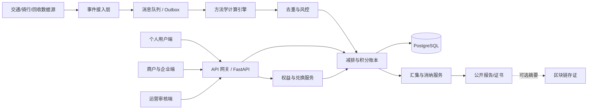

# CarbonLink 碳积分项目规划（黑客松版）

> 文档版本：v1.0  
> 调研基准日：2026-09-24  
> 适用场景：黑客松产品设计、需求评审、原型开发与路演  
> 说明：本文是产品与技术规划，不构成法律、审定、核查或碳资产交易意见。

## 1. 一页结论

### 1.1 建议做什么

将 CarbonLink 定位为一个“可信碳普惠协作平台”：个人通过公交、骑行、步行、回收、光盘等低碳行为获得可解释的碳减排记录与碳积分；商户提供优惠券、商品或服务作为激励；企业或活动主办方赞助权益、汇集并消纳对应减排贡献，获得可公开验证的影响力报告。

最适合黑客松的业务闭环是：

```text
低碳行为发生
  → 数据凭证接入/模拟
  → 方法学计算减排量
  → 风控与去重
  → 发放碳积分
  → 用户兑换权益
  → 对应积分核销
  → 企业汇集减排贡献并生成可验证报告
```

这条路线兼顾了社会价值、用户体验、商业闭环和技术亮点，也能复用当前仓库已经实现的不可变流水、审计、核销证书与链上存证能力。

### 1.2 黑客松期间不要做什么

- 不要把平台积分宣传为全国碳排放配额、CCER 或具有法定履约效力的碳资产。
- 不要在没有正式方法学、审定与登记的情况下承诺减排量可进入合规碳市场交易。
- 不要优先开发复杂的法币撮合交易、真实支付清算或公链代币炒作。
- 不要同时覆盖十几种行为；先把 2～3 个场景的证据、计算、去重和兑换做完整。
- 不要让“区块链”成为产品主角；先确保数据来源和核算可信，链只用于关键摘要和核销凭证存证。

### 1.3 推荐项目名与一句话介绍

**CarbonLink——让每一次低碳行动都有证据、有回报、有去向。**

## 2. 现行规则与产品边界

### 2.1 三个概念必须分开

| 概念 | 主要对象 | 计量单位 | 典型用途 | 对本项目的影响 |
|---|---|---:|---|---|
| 全国碳排放配额（CEA） | 纳入全国碳市场的重点排放单位 | tCO2e | 年度履约清缴、市场交易 | 不是个人积分，不作为 MVP 资产来源 |
| 国家核证自愿减排量（CCER） | 符合国家方法学的项目业主 | tCO2e | 自愿交易、按规定抵销履约 | 门槛高、周期长；MVP 只借鉴 MRV 流程 |
| 地方碳普惠减排量/碳积分 | 个人、家庭、社区、小微企业及场景运营方 | gCO2e、kgCO2e、tCO2e 或积分 | 商业激励、自愿抵销、地方市场消纳 | 是本项目最合适的定位 |

全国碳市场受《[碳排放权交易管理暂行条例](https://www.mee.gov.cn/zcwj/gwywj/202402/t20240205_1065850.shtml)》约束。2025 年钢铁、水泥、铝冶炼正式纳入，全国市场已覆盖发电、钢铁、水泥、铝冶炼等重点排放单位，见生态环境部《[全国碳排放权交易市场覆盖钢铁、水泥、铝冶炼行业工作方案](https://www.mee.gov.cn/xxgk2018/xxgk/xxgk03/202503/t20250326_1104736.html)》。这类配额履约体系与公众积分体系不能混用。

国家自愿减排市场依据《[温室气体自愿减排交易管理办法（试行）](https://www.mee.gov.cn/xxgk2018/xxgk/xxgk02/202310/t20231020_1043694.html)》运行。项目需要满足真实性、唯一性和额外性，遵循已发布方法学，并经过审定、登记、监测、核查、减排量登记和交易/注销等流程。

### 2.2 当前碳积分并无全国统一换算规则

现行碳普惠主要由地方制度和具体方法学驱动，并不存在一个全国统一的“1 kgCO2e 等于多少积分、多少人民币”的固定标准。各地共同结构大致如下：

1. 通过方法学规定适用条件、基准线、项目边界、排放因子、监测方法和计入期。
2. 从交通、能源、回收等可信数据源采集低碳行为凭证。
3. 核算减排量，并对真实性、唯一性和重复计算进行控制。
4. 将个人减排量按平台规则转换成积分，积分用于兑换商品或服务。
5. 将已兑换积分核销；对应减排贡献可按规则汇集，用于自愿抵销、活动碳中和或其他闭环消纳。

可参考的现行地方规则：

- 《[北京市碳普惠管理办法（试行）](https://www.beijing.gov.cn/zhengce/zhengcefagui/202508/t20250825_4182653.html)》将低碳出行、绿色建筑、可再生能源、资源循环利用、垃圾分类等列为优先场景，强调方法学、数据全过程管理、项目真实性与唯一性，并明确不得重复申报。
- 《[上海市碳普惠管理办法](https://sthj.sh.gov.cn/hbzhywpt2022/20251030/5c8129b3a2b340ad8a05947183c22587.html)》明确减排量可以转换为积分，用于兑换商品或服务；权益方可汇集已兑换积分并转换为减排量进行闭环消纳，同时要求数据可追溯、质量比对与存疑数据矫正。
- 《[深圳市碳普惠管理办法](https://www.sz.gov.cn/zfgb/2022/gb1254/content/post_10026317.html)》明确碳积分是个人参加碳普惠获得的回馈权益，由减排量按兑换规则换算；积分消费后应注销，应用运营方不得擅自转移或注销用户积分。
- 《[广东省碳普惠交易管理办法](https://gdee.gd.gov.cn/attachment/0/487/487047/3905857.pdf)》体现了“方法学—项目—核证减排量—交易/消纳”的管理路径，并强调方法学中的基准线和额外性。

### 2.3 CarbonLink 应采用的产品口径

- 对用户展示两个余额：**累计减排贡献（kgCO2e）**和**可用碳积分（point）**，不得混成一个概念。
- 减排贡献是基于平台方法学的估算值；碳积分是平台回馈权益，默认不可提现、不可个人之间交易。
- 只有经相应主管规则认可、完成正式核证登记的减排量，才可使用对应的官方名称或进入相应市场。
- 黑客松演示数据应明确标记“模拟数据”或“平台估算”，报告中展示数据源、因子版本和置信等级。
- 每一份环境权益只能有一个最终去向，兑换、捐赠、抵销和注销之间必须防止重复计算。

## 3. 用户痛点与项目价值

### 3.1 核心问题

- 个人：低碳行为零散，减排效果看不见，也缺少持续激励。
- 商户：愿意提供绿色权益，但不知道如何低成本获客和衡量影响。
- 企业/活动方：有 ESG、公益或活动碳中和诉求，但缺少可追溯的公众参与数据。
- 平台运营方：行为数据来源不同，存在刷量、重复上报、因子变更和隐私风险。
- 监管/核证方：需要看到完整的数据血缘、计算过程、审核记录与核销去向。

### 3.2 三方价值闭环

| 参与方 | 获得的价值 | 付出的资源 |
|---|---|---|
| 个人用户 | 积分、优惠、成就、个人低碳报告 | 经授权的行为数据、持续参与 |
| 权益商户 | 绿色获客、复购、品牌曝光、可量化贡献 | 优惠券、商品、服务或赞助金 |
| 企业/活动方 | 可追溯的公众减排贡献、ESG 活动报告 | 赞助权益、购买或支持消纳 |
| 平台 | 场景服务费、企业活动服务、数据接口服务 | 核算、风控、运营和审计能力 |

## 4. 业务角色与权限设计

### 4.1 产品角色

| 角色 | 主要职责 | 核心权限 |
|---|---|---|
| 个人用户 | 授权数据、参与低碳行为、兑换权益 | 查看碳账本；提交凭证；兑换/捐赠积分；下载个人报告；撤回授权 |
| 场景方/数据提供方 | 提供公交、骑行、回收等可信事件 | 批量上报签名事件；查询处理结果；处理异常事件 |
| 权益商户 | 配置可兑换权益并完成履约 | 创建商品/券；设置库存、积分价格、有效期；核销兑换码；查看效果 |
| 企业赞助方 | 发起低碳挑战并支持权益成本 | 创建活动；设置预算和目标；查看汇总数据；申请影响力报告 |
| 方法学管理员 | 配置核算规则及因子版本 | 创建草稿；模拟测算；提交审核；发布/停用版本 |
| 核证/审核员 | 独立复核场景、规则和异常记录 | 审核方法学；抽样复核；批准/驳回；不得直接改用户余额 |
| 平台运营员 | 用户、场景、商品和活动运营 | 管理活动、申诉、风控工单；无权单人发布方法学和调账 |
| 审计/监管观察员 | 检查数据质量与权益去向 | 只读访问审计日志、数据血缘、核销批次和公开报告 |
| 系统管理员 | 账号、密钥、配置与系统安全 | RBAC、密钥轮换、系统配置；不兼任日常核证审批 |

### 4.2 权限原则

- 采用 RBAC，并对“方法学发布、人工调账、批次注销”实行双人复核。
- 场景方只能访问自己上报的数据；企业只看聚合数据，不能查看个人轨迹。
- 积分流水采用追加写入，不直接修改历史记录；错误通过冲正流水修复。
- 审核员与被审核的项目/场景方应避免利益冲突。
- 所有高风险操作记录操作人、时间、原因、前后值和关联凭证。

## 5. 功能结构与优先级

### 5.1 MVP：必须完成，形成一条可演示闭环

#### A. 用户端

1. 手机号/邮箱登录与授权说明。
2. 个人碳账户：累计减排、可用积分、连续低碳天数、最近记录。
3. 行为记录：展示数据来源、活动量、基准情景、减排量、积分、状态。
4. 低碳挑战：例如“绿色通勤 7 天”。
5. 积分商城：浏览权益、兑换、查看兑换码与核销状态。
6. 个人影响力报告：按周/月展示行为分类和减排趋势。

#### B. 运营/管理端

1. 方法学与排放因子版本管理。
2. 行为事件接入：API 上报、CSV 导入和演示数据生成器。
3. 事件审核与风控：重复、超频、异常里程、时间冲突。
4. 碳积分复式流水：发放、冻结、消费、过期、冲正。
5. 权益商品、库存、兑换与核销管理。
6. 企业活动看板：参与人数、减排贡献、积分成本、兑换率。
7. 审计日志和公开核销报告。

#### C. 黑客松建议只做的三个行为场景

| 场景 | 活动数据 | 推荐凭证 | 演示难度 | 推荐级别 |
|---|---|---|---:|---|
| 公交/地铁替代燃油车 | 出行距离、方式、时间 | 模拟交通 API/票务记录 | 低 | 必做 |
| 骑行或步行替代燃油车 | 距离、起终点时间 | 模拟共享单车订单/运动记录 | 中 | 必做 |
| 回收饮料瓶或旧衣 | 类型、重量/件数、回收点 | 回收机签名记录/二维码 | 中 | 三选二或加分项 |

### 5.2 P1：有余力再做

- 团队/校园/企业排行榜，但仅展示昵称或聚合数据。
- 绿色商品标签和消费积分。
- 企业赞助池、预算扣减、活动模板和成果海报。
- 异常检测评分、人工复核工作台和用户申诉。
- 公共核销证书二维码与证书验证页面。
- 与当前链上 Outbox 对接，只把批次摘要、核销哈希和证书编号上链。

### 5.3 P2：赛后产品化

- 对接真实公共交通、共享出行、智能回收、能源账单数据。
- 地方正式方法学、第三方核证与碳普惠平台对接。
- 多租户、企业 SSO、预算结算、发票与权益供应商结算。
- 隐私计算、可验证凭证、跨平台防重复申领。
- 在获得明确资质与规则支持后，再考虑合规减排量交易或地方市场消纳。

## 6. 核算、积分与核销规则

### 6.1 通用核算公式

```text
基准排放量 = 活动水平 × 基准情景排放因子
项目排放量 = 活动水平 × 实际行为排放因子
减排量 = max(0, 基准排放量 - 项目排放量 - 泄漏量) × 保守系数
发放积分 = floor(减排量(kgCO2e) × 积分兑换率 × 质量系数)
```

其中：

- “活动水平”可以是公里、kWh、kg 或件数。
- 排放因子必须保存来源、适用地域、有效期、单位和版本号。
- 保守系数用于覆盖模型不确定性；数据可信度越低，系数越小。
- 积分兑换率是运营参数，不代表人民币价格，也不等于碳市场价格。
- 生产环境必须采用适用地区正式发布的方法学及因子；演示参数不得冒充官方值。

### 6.2 示例规则（仅供演示）

```text
示例：用户乘坐公交 8 km，假设基准情景为燃油小汽车
减排量 = 8 × (EF_燃油车 - EF_公交) × 保守系数
积分 = floor(减排量_kg × 10 × 质量系数)
```

页面应允许用户展开“为什么得到这些积分”，看到：活动数据、基准假设、两个排放因子、方法学版本、计算式、质量系数和最终结果。

### 6.3 积分账户规则

- 推荐演示兑换率：`1 kgCO2e = 10 积分`，仅作为平台运营参数。
- 积分类型：`available` 可用、`pending` 待审核、`frozen` 风控冻结、`spent` 已消费、`expired` 已过期、`reversed` 已冲正。
- 积分默认不可转赠、不可提现、不可撮合交易，降低金融化和洗钱风险。
- 建议设置 24 个月有效期；发放时展示到期日，按先到期先消费。
- 兑换时必须在同一事务中扣积分、扣库存、创建订单，避免超卖和重复扣款。
- 取消订单是否退分、过期是否退分，需要形成公开规则并保持一致。

### 6.4 减排贡献的唯一去向

每一条已确认减排记录必须维护 `environmental_claim_status`：

```text
unclaimed（未使用）
  → reserved（为兑换/活动暂占）
  → aggregated（汇集入批次）
  → retired（已消纳/注销，终态）
  ↘ released（失败后释放）
```

积分消费和减排量消纳不是同一件事，但二者必须建立可审计映射。建议按 FIFO 将已消费积分对应的减排记录汇集到消纳批次，生成唯一批次号和公开报告，防止同一减排贡献再次用于兑换、捐赠或企业声明。

## 7. 数据可信与反作弊设计

### 7.1 证据等级

| 等级 | 数据来源 | 处理方式 | 质量系数示例 |
|---|---|---|---:|
| A | 交通票务、共享单车、智能回收机等机构签名数据 | 自动确认，保留抽检 | 1.0 |
| B | 经授权的设备/平台数据，能验证时间和活动量 | 风控后确认 | 0.8～0.9 |
| C | 用户上传照片、票据或手工填报 | 人工/AI 辅助审核，严格限额 | 0.3～0.6 |

质量系数是产品建议，不是官方规则。比赛演示可重点展示同一行为因证据可信度不同而获得不同状态或积分。

### 7.2 必做风控规则

- 幂等键：`source + external_event_id` 全局唯一，重复上报只返回原结果。
- 时间冲突：同一用户不可能同时完成两段相距很远的行程。
- 速度校验：步行、骑行、公交分别设置合理速度区间。
- 里程上限：按单次、每日和场景设置阈值。
- 设备与账号关联：识别批量注册、模拟器和多账号共用设备。
- 地理围栏：回收行为必须在登记回收点发生；尽量只保存网格或站点，不保存精确轨迹。
- 凭证哈希：原始凭证对象存储，业务库保留哈希和访问引用。
- 延迟确认：高风险积分先进入 `pending/frozen`，复核后再变为可用。
- 冲正而非删账：发现欺诈后创建负向流水，同时保留原始记录和处置理由。

### 7.3 隐私要求

根据《[中华人民共和国个人信息保护法](https://www.cac.gov.cn/2021-08/20/c_1631050028355286.htm)》，行踪轨迹属于敏感个人信息，应坚持目的明确、最小必要、充分告知和单独同意。项目至少应做到：

- 默认保存“里程 + 时间段 + 场景方签名”，非必要不保存完整 GPS 轨迹。
- 用户可查看授权对象、用途、保存期限，并能撤回授权和申请删除。
- 企业看板只展示达到最小人数阈值后的聚合数据。
- 身份信息、行为明细和公开证书分区存储；公开证书不得反查个人轨迹。
- 测试数据与真实用户数据隔离，路演只使用模拟或明确授权的数据。

## 8. 信息架构与页面设计

### 8.1 用户端

```text
首页
├─ 今日减排与积分
├─ 低碳挑战
├─ 快捷记录/数据授权
└─ 推荐权益

碳账本
├─ 减排趋势
├─ 行为明细
├─ 计算详情
└─ 数据授权管理

积分商城
├─ 权益列表
├─ 权益详情
├─ 兑换确认
└─ 我的兑换码

我的影响
├─ 累计贡献
├─ 成就徽章
├─ 月度报告
└─ 已参与的消纳批次
```

### 8.2 管理端

```text
运营总览
├─ 用户/行为/减排/积分指标
├─ 异常告警
└─ 活动效果

方法学中心
├─ 方法学版本
├─ 排放因子库
├─ 计算模拟器
└─ 审核发布

数据与风控
├─ 行为事件
├─ 重复与异常检测
├─ 审核工单
└─ 申诉处理

权益中心
├─ 商户
├─ 商品与库存
├─ 兑换订单
└─ 券码核销

企业活动
├─ 活动配置
├─ 预算与目标
├─ 参与数据
└─ 影响力报告

审计与消纳
├─ 积分流水
├─ 减排记录
├─ 汇集批次
├─ 注销证书
└─ 操作审计
```

## 9. 技术架构建议



黑客松阶段继续采用当前仓库的 FastAPI + PostgreSQL + React 即可，不建议拆成微服务。代码层按领域模块解耦，部署仍为一个 API 服务，减少联调成本。

### 9.1 推荐后端模块

- `identity`：用户、组织、角色、授权与同意记录。
- `methodology`：方法学、因子、公式参数、版本和审批。
- `activity`：行为事件、证据、数据源、接入批次。
- `calculation`：核算结果、计算快照、置信等级。
- `risk`：规则命中、风险分、审核工单、申诉。
- `points`：积分账户与追加式流水。
- `rewards`：商户、商品、库存、订单和券码核销。
- `campaigns`：企业活动、挑战、目标、预算和聚合指标。
- `claims`：减排贡献汇集、消纳、报告与公开验证。
- `audit`：操作事件、数据血缘和可选链上 Outbox。

### 9.2 核心数据表

| 表 | 关键字段 |
|---|---|
| `users` | id、display_name、status |
| `organizations` / `memberships` | 组织类型、成员角色 |
| `consents` | 用户、数据类型、用途、版本、授权/撤回时间 |
| `data_sources` | 场景方、签名公钥、可信等级、状态 |
| `methodologies` / `methodology_versions` | 适用条件、公式、有效期、审批状态 |
| `emission_factors` | 因子值、单位、地域、来源、版本、有效期 |
| `activity_events` | source、external_id、user、活动量、时间、证据哈希、状态 |
| `calculation_records` | 基准排放、项目排放、减排量、因子快照、公式版本 |
| `risk_assessments` | 风险分、命中规则、处理状态、审核人 |
| `point_accounts` / `point_ledger_entries` | 变动值、余额、类型、关联事件、到期日 |
| `reward_items` / `reward_orders` | 商户、库存、积分价格、订单状态、核销码 |
| `campaigns` / `campaign_participants` | 企业、目标、预算、周期、参与者 |
| `claim_allocations` | 减排记录、积分消费/活动、分配数量、状态 |
| `retirement_batches` | 批次号、数量、受益方、用途、报告哈希、状态 |
| `audit_events` | 操作人、动作、资源、原因、时间、详情 |

### 9.3 关键 API

```text
POST   /api/v1/activity-events                 场景方上报行为（要求幂等键/签名）
GET    /api/v1/me/carbon-account               用户碳账户摘要
GET    /api/v1/me/activity-records             用户行为与计算明细
GET    /api/v1/me/point-ledger                  用户积分流水
GET    /api/v1/rewards                          权益列表
POST   /api/v1/reward-orders                    原子兑换
POST   /api/v1/reward-orders/{id}/redeem        商户核销券码
GET    /api/v1/campaigns                        挑战/企业活动列表
POST   /api/v1/campaigns/{id}/join              参加活动
POST   /api/v1/methodologies/{id}/publish        双人复核后发布版本
GET    /api/v1/risk-cases                        风控工单
POST   /api/v1/retirement-batches                汇集并锁定减排贡献
POST   /api/v1/retirement-batches/{id}/retire    注销并生成报告
GET    /public/retirements/{certificate_no}      公开验证
```

所有会改变余额、库存或消纳状态的接口都应支持 `Idempotency-Key`，并在单个数据库事务中完成。

## 10. 与当前 CarbonLink 仓库的衔接

### 10.1 可直接复用

- JWT 登录、管理员/核证员/成员的基础 RBAC。
- PostgreSQL、Alembic、Docker Compose 和端到端测试框架。
- 不可变账本思想、余额约束、事务处理和 `Idempotency-Key`。
- 项目审核、审计日志、注销证书和公开查询。
- 链上 Outbox，可用于异步存证而不阻塞业务主流程。
- React + TypeScript 管理控制台的整体框架。

### 10.2 需要新增或调整

| 当前能力 | 调整建议 |
|---|---|
| `Project → CreditBatch → Holding` | 新增 `ActivityEvent → CalculationRecord → PointLedger` 个人碳普惠链路；原项目链路保留为未来企业碳资产模块 |
| `MEMBER / VERIFIER / ADMIN` | 扩展为个人、场景方、商户、企业、方法学管理员、审核员、运营员、审计员、系统管理员 |
| 碳信用挂单交易 | 从黑客松主导航降级；主导航改成碳账户、低碳挑战、积分商城、企业活动 |
| `Retirement` | 扩展为“减排贡献汇集—分配—注销”，增加积分消费到减排记录的映射 |
| 区块链合约 | MVP 只存项目/批次/注销摘要，不发行可自由炒作的个人代币 |
| Dashboard | 增加参与人数、行为次数、确认减排量、发放/消费积分、兑换率、异常率和权益成本 |

建议不要删除当前交易模块，而是把它标记为“专业碳资产实验区/后续能力”，黑客松演示默认隐藏，避免评委把项目理解成缺少合规基础的个人碳交易平台。

## 11. 黑客松团队分工

### 11.1 五人队推荐

| 角色 | 主要任务 | 明确交付物 |
|---|---|---|
| 产品/队长 | 场景选择、需求收敛、规则口径、路演统筹 | PRD、用户流程、演示脚本、答辩材料 |
| 前端/交互 | 用户端碳账户、商城、管理看板 | 可运行前端、关键动效、响应式页面 |
| 后端/账本 | 行为接入、积分账本、兑换事务、权限 | API、数据库迁移、核心测试 |
| 数据/算法 | 方法学引擎、因子管理、风控评分 | 计算解释页、异常检测、测试数据集 |
| 商业/设计/路演 | 商户权益、企业方案、视觉与讲述 | 品牌视觉、商业模型、Pitch Deck、演示视频 |

### 11.2 三人队推荐

- A：产品 + 前端 + 路演。
- B：后端 + 数据库 + 部署。
- C：方法学 + 风控 + UI 设计 + 测试数据。

团队内部还要指定一人兼任“演示负责人”，冻结演示环境、账号、数据和讲稿，最后半天不再随意改主流程。

## 12. 48 小时实施计划

### 0～6 小时：定范围

- 确定两个行为场景、一个企业挑战和三件兑换权益。
- 画出用户完整流程，冻结术语和积分规则。
- 准备可重复导入的演示数据，定义成功指标。

### 6～20 小时：打通主链路

- 新增行为事件、计算记录、积分流水和权益订单表。
- 完成模拟数据接入、方法学计算和幂等去重。
- 完成碳账户、行为明细和积分商城基础页面。

### 20～32 小时：完成闭环

- 完成原子兑换、商户核销、企业活动看板。
- 完成减排贡献汇集与公开核销报告。
- 加入至少三条反作弊规则和一条人工复核流程。

### 32～40 小时：提升可信度

- 增加计算解释、因子版本、证据等级和数据血缘。
- 增加授权管理、隐私说明和模拟数据标识。
- 补充核心自动化测试和异常状态页面。

### 40～48 小时：只做演示稳定性

- 冻结功能；只修阻断性问题。
- 使用固定账号和数据完整演练至少三遍。
- 录制备用演示视频，准备离线截图和常见问答。

## 13. 三分钟演示脚本

1. **问题（20 秒）**：普通人的低碳行为看不见、难验证、没有持续回报；企业也难衡量公众参与带来的真实影响。
2. **个人行为（35 秒）**：模拟导入一次公交出行；系统自动去重并显示减排量、方法学版本和计算过程。
3. **即时激励（30 秒）**：积分进入碳账户，用户参加“绿色通勤周”，在商城兑换咖啡折扣券。
4. **商户履约（20 秒）**：商户扫码核销，库存和积分流水原子更新。
5. **企业价值（35 秒）**：企业看板展示参与人数、确认减排、兑换率和预算使用，但看不到个人轨迹。
6. **可信闭环（25 秒）**：展示重复事件被拦截、因子版本和审计日志；将已消费积分对应贡献汇集并生成公开核销报告。
7. **愿景（15 秒）**：未来接入真实交通/回收数据和地方碳普惠机制，让个人行动、商业激励和企业责任真正连接。

## 14. 评审指标与北极星指标

### 14.1 产品指标

- 北极星指标：**每周经确认且完成激励闭环的减排贡献量（kgCO2e）**。
- 激活率：注册后 24 小时内完成首个确认行为的用户占比。
- 7 日留存：连续参与低碳挑战或再次产生有效行为的用户占比。
- 兑换率：发放积分中被用于有效权益的比例。
- 单位激励效率：每 1 kgCO2e 确认减排对应的权益成本。

### 14.2 可信度指标

- 数据源 A/B 级占比。
- 重复事件拦截率与误杀申诉率。
- 计算记录具备完整因子版本和证据哈希的比例，目标 100%。
- 积分账本与账户余额对账差异，目标 0。
- 已声明/已消纳减排贡献的重复分配数，目标 0。

## 15. 商业模式

优先采用 B2B2C，而非向个人收费：

- 企业低碳挑战 SaaS 服务费。
- 企业 ESG/活动影响力报告和可信核销服务费。
- 商户绿色营销活动服务费或按核销效果计费。
- 数据源/场景方的方法学计算与反作弊 API 服务。
- 在具备正式资质与地方规则对接后，拓展减排量开发和消纳服务。

平台不能依赖“积分升值”吸引用户。可持续性应来自企业营销/ESG 预算、商户获客价值和真实场景合作。

## 16. 主要风险与应对

| 风险 | 表现 | 应对 |
|---|---|---|
| 概念混淆 | 把积分称为 CCER/碳配额 | 产品文案明确“平台回馈权益”和“估算减排贡献” |
| 重复计算 | 同一出行在多个平台领分或多次消纳 | 来源事件唯一键、跨批次分配约束、终态注销 |
| 因子失真 | 使用不适用地区或已过期因子 | 因子版本化、来源可见、有效期校验、计算快照 |
| 刷量作弊 | GPS 模拟、重复票据、批量账号 | 签名数据源、速度/频率规则、设备风控、延迟确认 |
| 隐私泄露 | 企业可看到个人轨迹 | 最小化采集、单独同意、聚合展示、分区存储 |
| 权益不可兑 | 库存超卖、商户拒绝核销 | 原子扣减、库存锁、核销 SLA、申诉与补偿规则 |
| 财务不可持续 | 积分发放过快、赞助预算不足 | 动态运营倍率、活动预算上限、积分负债看板 |
| 区块链喧宾夺主 | 有链无可信数据 | 先验证源头与方法学，链上仅记录关键摘要 |

## 17. 验收标准

黑客松版本满足以下条件即可视为完整：

- [ ] 用户可以看到一条由可信或模拟数据源产生的低碳行为。
- [ ] 系统能展示可解释的减排计算和方法学/因子版本。
- [ ] 相同外部事件重复提交不会重复发分。
- [ ] 至少一种异常行为会被冻结并进入审核。
- [ ] 用户可用积分兑换权益，余额和库存一致。
- [ ] 商户可以核销兑换码，重复核销会失败。
- [ ] 企业只能看到聚合影响数据，看不到个人轨迹。
- [ ] 已消费积分可映射到减排记录并汇集为消纳批次。
- [ ] 公开页面可验证唯一核销证书及其用途。
- [ ] 全链路有审计记录，关键写操作支持幂等。

## 18. 最终取舍建议

如果时间非常紧，只保留以下六项：

1. 公交出行模拟数据接入。
2. 可解释的减排量计算。
3. 追加式碳积分账本。
4. 一件真实感强的权益兑换与核销。
5. 一条重复上报拦截规则。
6. 一个企业活动影响力与公开核销页面。

这六项已经能讲清楚 CarbonLink 的完整价值：**行为有数据、核算有依据、积分有用途、企业有价值、减排有去向、全程可审计。**

## 19. 官方参考资料

1. 国务院：《[碳排放权交易管理暂行条例](https://www.mee.gov.cn/zcwj/gwywj/202402/t20240205_1065850.shtml)》
2. 生态环境部、市场监管总局：《[温室气体自愿减排交易管理办法（试行）](https://www.mee.gov.cn/xxgk2018/xxgk/xxgk02/202310/t20231020_1043694.html)》
3. 生态环境部：《[全国碳排放权交易市场覆盖钢铁、水泥、铝冶炼行业工作方案](https://www.mee.gov.cn/xxgk2018/xxgk/xxgk03/202503/t20250326_1104736.html)》
4. 北京市生态环境局：《[北京市碳普惠管理办法（试行）](https://www.beijing.gov.cn/zhengce/zhengcefagui/202508/t20250825_4182653.html)》
5. 上海市生态环境局：《[上海市碳普惠管理办法](https://sthj.sh.gov.cn/hbzhywpt2022/20251030/5c8129b3a2b340ad8a05947183c22587.html)》
6. 深圳市生态环境局：《[深圳市碳普惠管理办法](https://www.sz.gov.cn/zfgb/2022/gb1254/content/post_10026317.html)》
7. 广东省生态环境厅：《[广东省碳普惠交易管理办法](https://gdee.gd.gov.cn/attachment/0/487/487047/3905857.pdf)》
8. 中央网信办：《[中华人民共和国个人信息保护法](https://www.cac.gov.cn/2021-08/20/c_1631050028355286.htm)》

