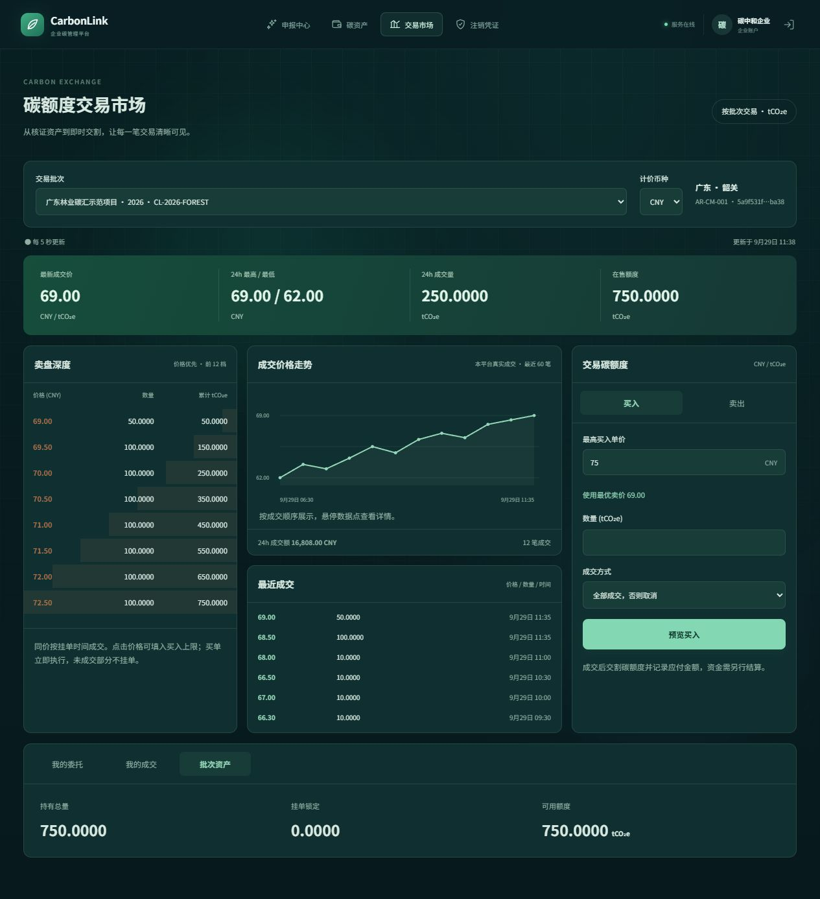

# Mini-DEX 融合：碳额度交易市场（旧版离线模式）

本文件后半部分描述 `BLOCKCHAIN_ENABLED=false` 时保留的旧版数据库撮合逻辑，仅用于测试和历史兼容。正式链上模式使用 `CarbonMarketplace`：所有经过审批并完成链上签发的批次共享唯一的 `CARBON/USDC` 交易对，买单、卖单、成交、撤单均由用户钱包签名。

链上交易盘复用了 Mini-DEX 的价格时间优先呈现、买卖双边订单簿、最近成交、24 小时行情和 OHLCV K 线交互，但不复用其中心化 Vault。买单托管 USDC 并接受任意合格批次，卖单托管指定的 ERC-1155 交付批次；所有批次共享市场价格，成交由市场合约原子交割，平台只负责项目材料审核和链上签发。

CarbonLink 将 Mini-DEX 的价格—时间优先、maker 价格成交、累计深度和买卖工作台交互适配到现有碳额度数据库账本。原项目保持不变，无需另行启动 Mini-DEX 的 Node 服务。

## 交易规则

- 每个 `batch_id + currency` 是独立市场，不混合不同项目、年份、方法学或币种。
- 卖出限价单锁定已有额度，可部分成交；撤单只解锁剩余数量。
- 买入请求按卖价从低到高、同价按创建时间执行；同一时间用委托 ID 确定顺序。成交使用卖方挂单价。
- 买入必须指定 `max_unit_price`，每笔成交价不超过上限。
- `FOK`（默认）表示全部成交或整笔取消；`IOC` 表示立即成交可用部分，余量取消。两者均不生成待成交买单。
- 撮合先预检完整成交路径，遇到自己的实际对手单时拒绝整笔请求，不留下部分交割。
- 数量为 Decimal 四位精度、价格两位精度；每笔应付金额四舍五入至两位，汇总等于逐笔金额之和。数据库金额范围外的成交返回 422。
- 报价仅预览，不预占库存；确认时重新撮合。盘口变化可能导致实际金额下降、IOC 成交数量下降或 FOK 被拒绝。

当前没有资金托管、支付扣款、充值提现或有资金担保的双边买单簿。交易延续 CarbonLink 的额度交割与应付金额记录语义，资金由外部流程结算。没有引入 Mini-DEX 的测试币水龙头、虚拟做市资金、Binance AVAX 行情或 ERC-20 Vault；碳额度仍使用原有批次账本和 ERC-1155 合约体系。

## 页面

企业端与管理端的 `/market` 共用交易工作台：统一 `CARBON/USDC` 行情、前 12 档双边盘口、K 线、最近成交、限价委托和个人当前委托。批次只在卖出时作为链上交付来源选择，不再作为交易对或行情筛选条件。

行情每 5 秒轮询。最新价来源于本批次实际成交；24 小时统计和在售总量在服务端聚合完整数据，不受盘口深度或个人列表分页影响。请求失败明确显示旧数据状态。公开成交列表不包含买卖双方账号。

## API

| 接口 | 说明 |
| --- | --- |
| `GET /api/v1/market/instruments` | 批次、项目名称、地区、年份、方法学、既有计价币种 |
| `GET /api/v1/market/snapshot?batch_id=...&currency=CNY&depth=12` | 聚合卖盘、全量在售数量、24h 行情和匿名成交记录 |
| `GET /api/v1/market/orders?batch_id=...&currency=CNY&offset=0&limit=10` | 当前用户委托，包含已成交/已撤销状态，返回 `X-Total-Count` |
| `POST /api/v1/market/quote` | 登录后预览可成交数量、笔数、金额和是否满足成交方式 |
| `POST /api/v1/market/execute` | 登录后自动撮合，必须带 `Idempotency-Key` |

报价与执行请求示例：

```json
{
  "batch_id": "已发行批次的 ID",
  "currency": "CNY",
  "quantity": "150.0000",
  "max_unit_price": "69.00",
  "time_in_force": "FOK"
}
```

执行返回 `filled_quantity`、`remaining_quantity`、`total_amount` 和逐笔 `trades`。同一用户重复提交已处理的幂等键返回 409，失败事务的幂等占位一并回滚。网络响应不确定时应保留原键重试，并查个人成交记录确认结果。

原有挂单、指定挂单购买、撤单接口兼容。挂单接口新增可选 `Idempotency-Key`（新页面必传），个人成交接口新增 `batch_id` 和 `currency` 筛选。无需数据库结构迁移。

## 一致性与验证

生产环境使用 PostgreSQL。撮合、原购买接口、挂单、撤单和注销统一按「批次 → 委托 → 持仓」顺序加锁；每个批次的库存写操作串行化，允许不同批次并行。成交、持仓、双向流水、审计及幂等占位在同一事务中提交。SQLite 仅适用于本地功能验证，不提供相同的行锁保证。

`tests/test_market.py` 覆盖价格/时间优先、maker 价格、跨批次/币种隔离、FOK 回滚、IOC 余量、自成交预检、报价后撤单、金额舍入、幂等、个人数据权限、盘口聚合、24h 时间窗口以及 PostgreSQL 并发抢单和新旧购买路径竞争。

```text
docker build --target test -t carbon-link-test .
docker run --rm carbon-link-test
cd carbon-link-front
npm run build
```

并发测试需显式设置 `CARBONLINK_TEST_DATABASE_URL`，指向独立 PostgreSQL 数据库 `carbon_link_test`。测试会删除并重建此测试库中的应用表，不能指向业务数据库。未设置时默认 SQLite，并跳过 PostgreSQL 并发测试。

部署更新：`docker compose up --build -d api carbon-link-front`。来源与许可保留在 `THIRD_PARTY_NOTICES.md`。

## 本次验收

- PostgreSQL 17 独立测试库：32 项测试全部通过，包含两项并发竞争测试。
- TypeScript 检查与 Vite 生产构建通过；本机 API 健康检查和 `/market` 返回成功。
- 隔离演示数据中验证跨两档购买 150 tCO₂e、持仓增加、25% 比例卖出、撤单解锁和窄屏无横向溢出。
- 测试容器与临时数据库在验收后清理，业务数据库未注入演示数据。


